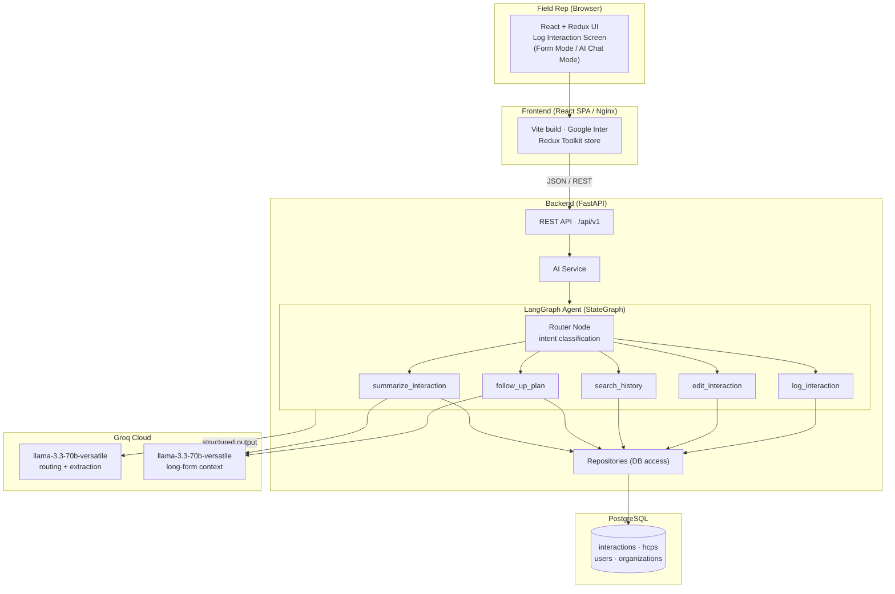

# AI-First CRM — HCP Module: Log Interaction Screen

An **AI-first Customer Relationship Management** system focused on the
**Healthcare Professional (HCP) module**, built for pharmaceutical field
representatives. The centerpiece is the **Log Interaction Screen**, which lets a
rep capture an HCP interaction two ways: a **structured form** or a
**conversational AI chat** powered by a **LangGraph** agent backed by **Groq**
LLMs.

---

## Tech Stack

| Layer      | Technology |
|------------|------------|
| Frontend   | React 19 + Redux Toolkit (state) + MUI + Vite |
| Backend    | Python + FastAPI |
| AI Agent   | LangGraph (`StateGraph`) |
| LLM        | Groq — **`llama-3.3-70b-versatile`** (default) + `gemma2-9b-it` (decommissioned by Groq; configurable via `GROQ_MODEL`) |
| Database   | PostgreSQL (SQLAlchemy ORM + Alembic) |
| Font       | Google **Inter** (`@fontsource/inter`) |

---

## Architecture



**Request flow**

1. The rep interacts with the **Log Interaction Screen** (structured form or AI chat).
2. The React/Redux frontend sends REST calls to the **FastAPI** backend.
3. Chat messages go through the **AI Service** into the **LangGraph agent**, which
   routes the message to one of five tool nodes.
4. Tools call **Groq** (`llama-3.3-70b-versatile` for routing/extraction and context;
   `gemma2-9b-it` was decommissioned by Groq) and read/write the database via repositories.
5. All interaction data is persisted in **PostgreSQL**.

Both services are containerized (see `server/Dockerfile`, `client/Dockerfile`,
`docker-compose.yml`) and published as Docker Hub images via the GitHub Actions
pipeline in `.github/workflows/dockerhub.yml`.


---

## What the application does

A field rep opens the **Log Interaction Screen** and can:

1. **Form Mode** — fill a structured form (doctor, visit type, date, products
   discussed, notes, follow-up date) and save it to the database.
2. **AI Chat Mode** — type a free-form message like *"Met Dr. Khan today about
   CardioPlus, plan a follow-up next month"*. The LangGraph agent extracts
   structured fields, updates the live form, and can auto-save the interaction
   when a doctor and date are resolved.

Both modes write to the same `interactions` table and are visible in the
**Interaction History** screen.

---

## Role of the LangGraph Agent in managing HCP interactions

The LangGraph agent is the "brain" that turns messy, conversational rep notes
into clean, structured CRM records. Its responsibilities:

- **Intent routing** — a router node classifies the user's message into exactly
  one of five sales activities and routes to the matching tool node.
- **Entity extraction & summarization** — using the LLM's structured-output
  capability, it pulls out doctor, visit type, dates, products, objective,
  summary, and outcome from natural language.
- **Safe data operations** — tools read/write the database through repositories,
  keeping the LLM isolated from raw SQL.
- **Coaching** — it can generate follow-up plans and concise summaries to help
  reps prepare their next touchpoint.

The graph (`server/app/agents/graph.py`) is a linear **router → tool → END**
`StateGraph`. If `GROQ_API_KEY` is unset, it falls back to keyword-based demo
routing so the app still runs.

---

## The five LangGraph tools

| Tool | Purpose | How it works |
|------|---------|--------------|
| **1. Log Interaction** *(required)* | Capture a new HCP visit | Uses the LLM (`llama-3.3-70b-versatile`) with structured output to extract `doctor_id`, `visit_type`, `date`, `products_discussed`, `notes`, `follow_up_date`, `objective`, `summary`, `outcome`. Merges into the current form and auto-saves when doctor + date resolve. LLM performs summarization/entity extraction. |
| **2. Edit Interaction** *(required)* | Modify a logged interaction | LLM identifies the target interaction (by `interaction_id`, doctor name, or date) and the fields to change; the tool applies only the requested updates via the interaction repository and returns the refreshed record. |
| **3. Search Interaction History** | Find past visits | LLM extracts filters (doctor, visit type, date range); the tool queries the repository and returns matching interactions. |
| **4. Generate Follow-up Plan** | Next-step coaching | Locates the interaction/doctor, then the LLM (`llama-3.3-70b-versatile`) produces objectives, talking points, channel/timing, objections, and success metrics. |
| **5. Summarize Interaction** | Concise recap | Locates the interaction, then the LLM (`llama-3.3-70b-versatile`) condenses it into 3–5 CRM-ready bullets. |

---

## Repository layout

```text
ai-first-crm/
├─ client/                # React + Redux frontend (Vite)
│  └─ src/
│     ├─ app/             # store, router, theme (Inter font)
│     ├─ features/        # Redux slices (hcp, interactions, logInteraction)
│     └─ pages/           # Dashboard, HCP list, Log Interaction, History
├─ server/                # FastAPI backend
│  └─ app/
│     ├─ agents/          # LangGraph graph, router, tools, LLM, schemas
│     ├─ api/v1/endpoints # REST routers (ai, hcps, interactions, ...)
│     ├─ models/          # SQLAlchemy models
│     ├─ repositories/     # DB access layer
│     └─ db/              # session, base, seed
├─ README.md              # this file
└─ RUN.md                 # detailed install/run/test guide
```

---

## How to run

Full, copy-paste instructions (PostgreSQL setup, Alembic, seeding, testing all
five tools) are in **[RUN.md](./RUN.md)**. Quick start:

### Backend
```powershell
cd server
python -m venv .venv
.\.venv\Scripts\Activate.ps1
pip install -r requirements.txt
python -m alembic upgrade head      # create schema
python -m app.db.seed               # optional demo data
python -m uvicorn app.main:app --reload --port 8000
```
Set `GROQ_API_KEY` in `server/.env` to enable real LLM behavior
(`llama-3.3-70b-versatile`). Without it the agent runs in demo (keyword) mode.

### Frontend
```powershell
cd client
npm install
npm run dev                         # http://localhost:5173
```

The frontend calls the backend at `http://localhost:8000/api/v1`
(CORS pre-configured).

---

## Key API endpoints

- `POST /api/v1/ai/chat/messages` — send a message to the LangGraph agent
- `POST /api/v1/interactions` — create an interaction (used by Form/auto-save)
- `GET  /api/v1/interactions` — interaction history
- `PUT  /api/v1/interactions/{id}` — edit an interaction
- `GET  /api/v1/hcps` — list healthcare professionals

Interactive docs: `http://localhost:8000/docs`

---

## Deployment (Docker)

Both services are containerized and can run locally with Docker Compose, and
are published to Docker Hub automatically via CI/CD.

### Local (Docker Compose)

```powershell
# optional: copy .env.example -> .env and set GROQ_API_KEY
docker compose up --build
```

- Frontend: http://localhost:5173
- API docs: http://localhost:8000/docs

`db` (PostgreSQL 16) is health-checked; the `server` waits for it, `DB_AUTO_CREATE`
is on so tables are created on first run, and the `client` build bakes in
`VITE_API_BASE_URL` to reach the backend.

### Images & CI/CD

| Image | Dockerfile |
|-------|------------|
| `ai-first-crm-server` | `server/Dockerfile` (python:3.13-slim + FastAPI) |
| `ai-first-crm-client` | `client/Dockerfile` (node:24 build → nginx:alpine) |

On every push to `main`, `.github/workflows/dockerhub.yml` builds and pushes both
images to Docker Hub, tagged `latest` and by commit SHA. Required repo secrets:
`DOCKERHUB_USERNAME` and `DOCKERHUB_TOKEN`.

## Notes on the assignment requirements

- **LangGraph + LLM are mandatory** — satisfied: a compiled `StateGraph` agent
  calls Groq's `llama-3.3-70b-versatile` (the `gemma2-9b-it` model named in the brief was decommissioned by Groq).
- **Structured form OR chat** — satisfied on the Log Interaction Screen.
- **≥5 tools incl. Log + Edit Interaction** — satisfied (5 tools, both required).
- **Postgres SQL** — satisfied (MySQL/Postgres allowed).
- **Google Inter font** — satisfied via `@fontsource/inter`.
